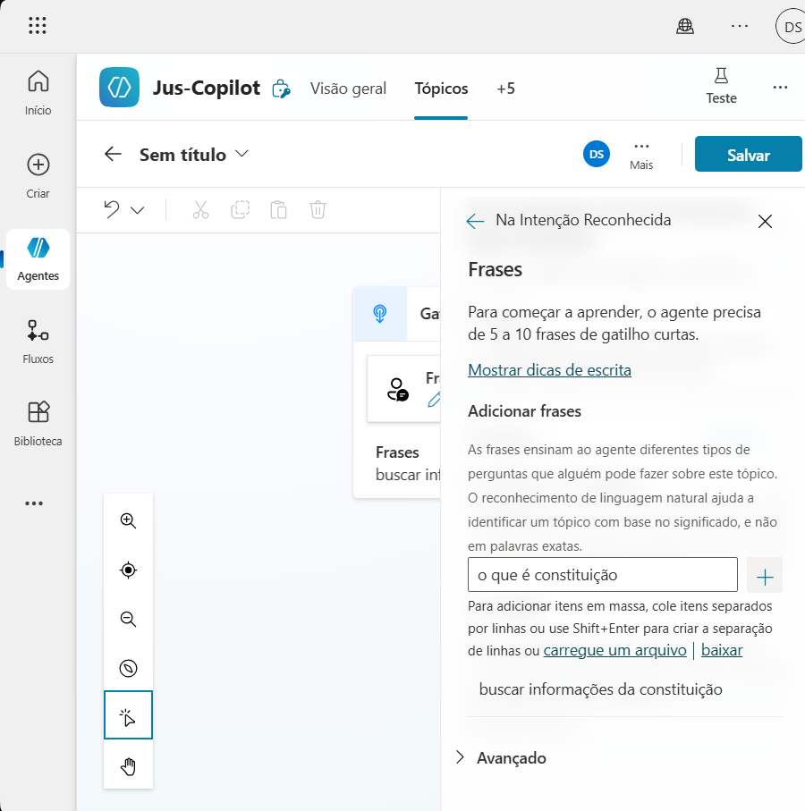
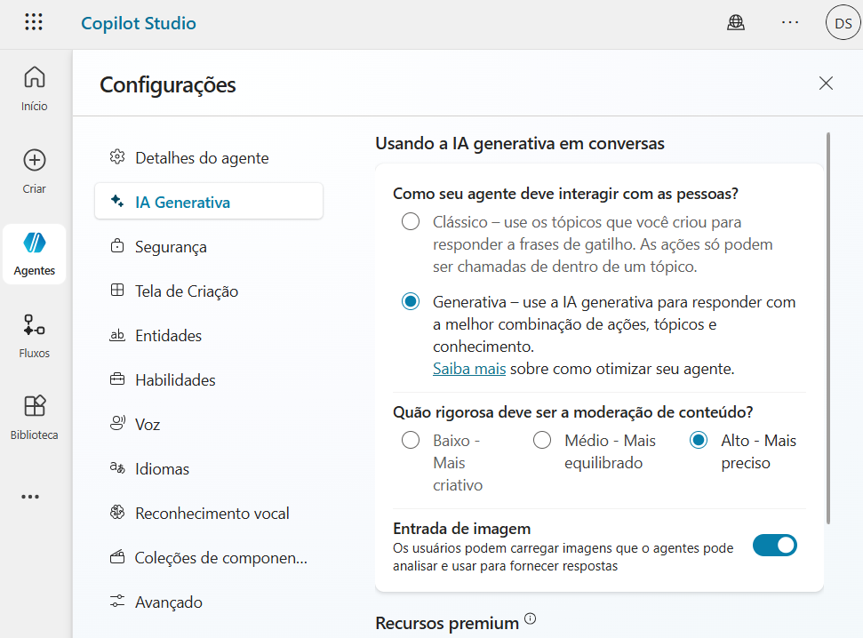
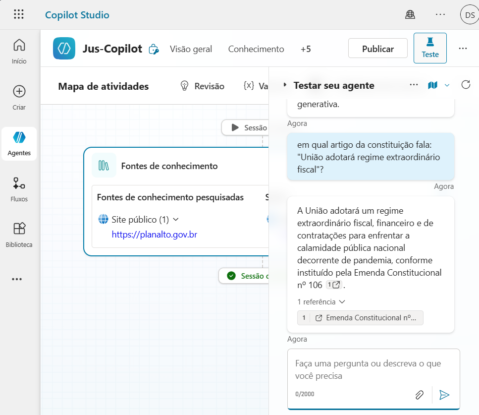

# Criando um fluxo personalizado de conversa no Copilot Studio

Abaixo seguem as descrições de como foi criado o projeto de Agente IA no Copilot Studio

---

### 🖼️ Criação do Agente em Branco

> O Agente que criei teve o seu ponto de partida em branco dentro de um novo ambiente. Foram realizados passos como nomeação de nome, descrição, além de instruções que direcionam o nosso agente no que ele deve fazer ao ser chamado.

### Resumo

> O Agente em Branco no Copilot Studio é toda criação de um agente de IA que seja de caráter personalizável, sendo o seu ponto de partida vazio, sem pré configuração, que não possui prompts definidos e é ideal para começar do zero

---

### 🖼️ Customização do tópico

> Em seguida foi realizado a customização do tópico, entrando na aba "Tópicos", adicionando o tópico em branco e personalizando as frases de gatilho.
> Criei em seguida uma ação através de respostas generativas, adicionando uma nova mensagem para finalizar a customização do tópico utilizado.

### Resumo:

> Nesse passo foi realizado a personalização do tópico, que é um bloco de conversa ou de conhecimento que a IA usa para responder as perguntas dentro do fluxo.
> Nele é possivel ajustar a forma como é respondido o tema, definir limites sobre os tópicos e garantir a linguagem correta

---

### 🖼️ Personalizando a mensagem de erro

> Para realizar a personalização da mensagem de erro, acessei o tópico do meu agente na aba "System" onde será encontrado a configuração de "Fallback" ou "Conversation boosting", escolhendo uma das duas é possivel criar uma mensagem de erro com algumas informações de contato para o usuário solicitar um suporte em relação ao seu problema.

### Resumo:

> Quando criamos um agente é importante personalizar mensagens de erro, para controlar e definir como a IA pode se comportar quando ocorre um erro inesperado, que foge do fluxo padrão.

---

### 🖼️ Ajustando a qualidade de respostas com GenAI

> Foi também customizado o prompt, indicando para o meu agente buscar dados sobre um determinado assunto. Para que a resposta dos documentos serem mais concisos foram declaradas respostas em nível Alto.

### Resumo:

> Quando lidamos com a criação de um Agente Ia no Copilot Studio é possivel ajustar o comportamento dela para que as respostas geradas tenham mais características, podendo colocar variáveis como o nome do usuário nas respostas, e ajustar o nível de formalidade.

---

### Resultado final do projeto:

---

## 📄 Informações

- **Nome:** Daniel Silva
- **Curso:** Python Developer- DIO
- **LinkedIn:** [https://www.linkedin.com/in/daniel-silva-6216b1268/)
